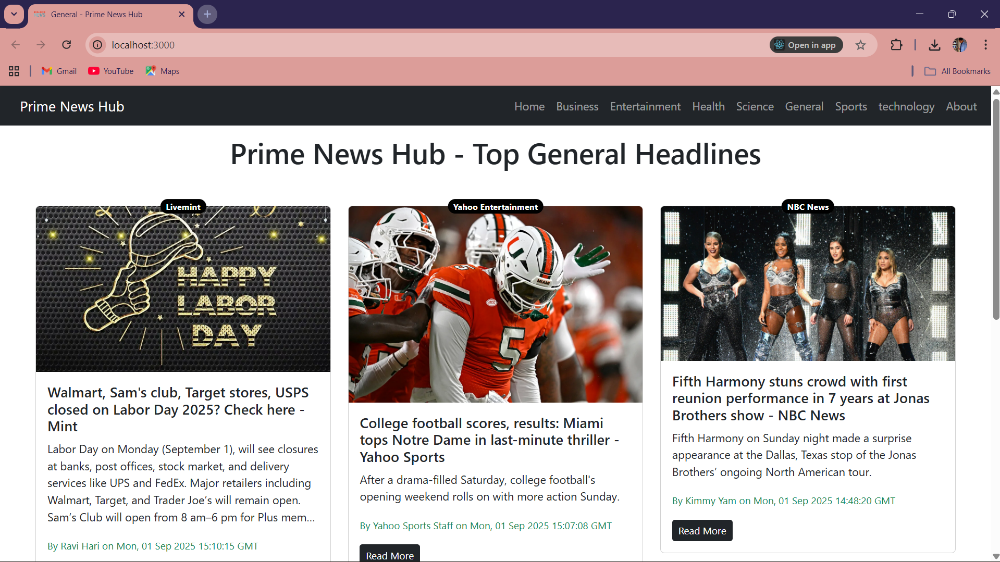
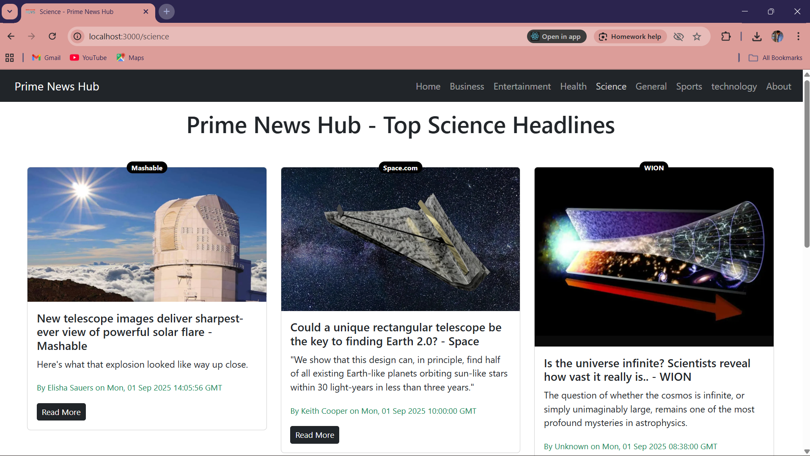
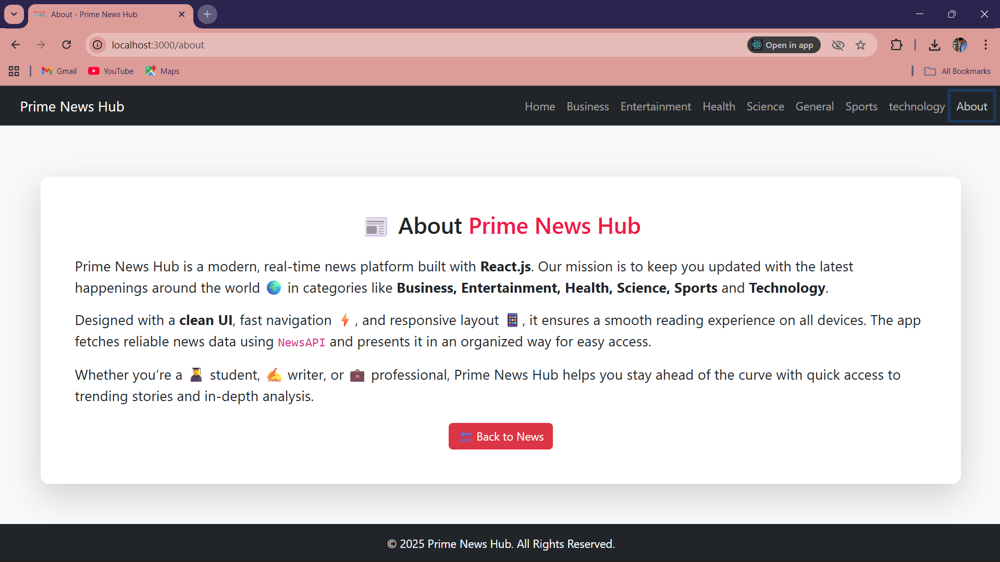

# 📰 Prime News Hub By Aamir

[API Used](https://newsdata.io/)

-Prime News Hub is a modern, real-time news web application built with **React.js**. Stay updated with the latest news across multiple categories like Business, Health, Sports, Technology, and more, with a smooth, responsive interface.

---

## Features ✨

- **Real-time news** fetched from [NewsAPI](https://newsdata.io/)
- **Infinite Scroll** for continuous browsing
- **Progress Bar** to show loading status
- **Category-wise News**: Business, Entertainment, Health, Science, Sports, Technology, General
- **Responsive UI** for all devices
- **Direct links** to full articles
- **Clean and modern design**

---
## Live
- https://prime-news-hub-react.vercel.app/
---
## Screenshots 🖼️

Home Page:



Science News:



About Page:



---

## Technologies 🛠️

- **Frontend:** React.js, JavaScript, Bootstrap  
- **API:** NewsAPI  
- **Tools:** VS Code, GitHub  
- **Design:** Responsive and mobile-friendly

---

## Installation 💻

1. Clone the repository:  
   ```bash
   git clone https://github.com/Aamir-sf/Prime-News-Hub.git
2. Install dependencies:
   ```bash
   npm install
4. Create a .env file in the root folder and add your NewsAPI key:
   ```bash
   REACT_APP_NEWS_API=YOUR_API_KEY
6. Start the application:
   ```bash
   npm start

📦 Folder Structure
   ```bash
Prime-News-Hub/
├── public/
├── src/
│   ├── components/
│   │   ├── About.js
│   │   ├── NavBar.js
│   │   ├── News.js
│   │   ├── NewsItem.js
│   │   └── Spinner.js
│   ├── App.js
│   └── index.js
├── .env
├── package.json
└── README.md

